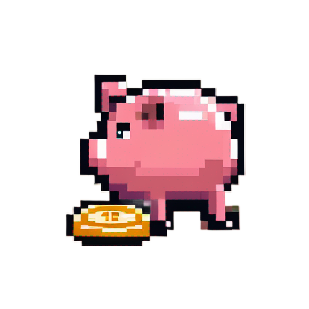

<div align="center">



# piggybank

[![][site-badge]][site-url] [![npm][npm-img]][npm-url]
[![GitHub Workflow
Status][gh-actions-img]][github-actions]
[![Coverage][cov-img]][cov-url]

</div>

(unofficial) [Safe](https://safe.global) library, powered by [viem](https://viem.sh).

> only Safe v1.3 is supported at the moment

## Features

- Works with Viem (official SDK supports only ethers@5 and web3.js)
- EIP3770 address support
- Protocol Kit + API Kit included (both WIP)
- Minimal deps

## Install

```sh
pnpm i viem @stauro/piggybank
```

[site-url]: https://piggybank.stauro.xyz
[npm-url]: https://npmjs.com/package/@stauro/piggybank
[github-actions]: https://github.com/StauroXYZ/piggybank/actions
[gh-actions-img]: https://img.shields.io/github/actions/workflow/status/StauroXYZ/piggybank/ci.yml?branch=master&style=for-the-badge&logo=github&label=&color=1B2A22
[cov-img]: https://img.shields.io/coveralls/github/StauroXYZ/piggybank?style=for-the-badge&color=1B2A22
[cov-url]: https://coveralls.io/github/StauroXYZ/piggybank
[npm-img]: https://img.shields.io/npm/dt/@stauro/piggybank?style=for-the-badge&color=1B2A22&logo=npm&label=
[site-badge]: https://img.shields.io/badge/website-open-1B2A22?style=for-the-badge